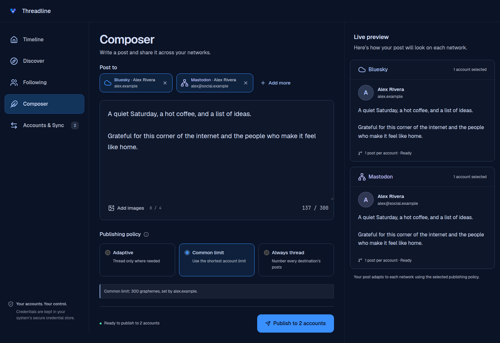
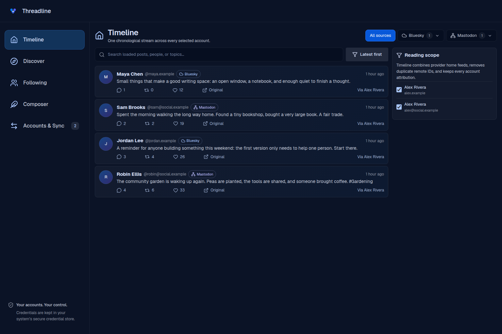
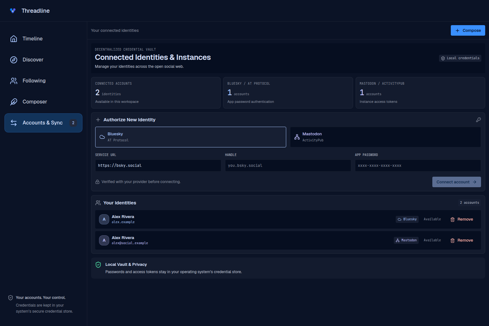

# Threadline

A desktop client for Bluesky and Mastodon. Read your timelines together, write one draft, and preview how it will publish to each account.



*Screenshots show the actual interface with example accounts and posts.*

## What you can do

- Read a combined home timeline with account filters and source attribution.
- Publish to multiple accounts, with thread splitting for each destination’s text limit.
- Choose a common limit, adapt to each account, or always number your thread.
- Attach up to four images with alt text and get hashtag suggestions as you type.
- See publication results per account, including partial failures.
- Keep account credentials in your operating system’s credential store.

Threadline opens on **Timeline**. The workspace also includes **Notifications**, **My profiles**, **Discover**, **Following**, **Composer**, and **Accounts & Sync**. Composer keeps the active draft while you move between views; the **Accounts & Sync** badge shows how many accounts have a connected client.

<details>
<summary>Timeline and account management</summary>

### Timeline



### Accounts & Sync



</details>

## Run locally

You’ll need Node.js 22.12+ (or 20.19+), npm, stable Rust, and the [Tauri prerequisites for your OS](https://v2.tauri.app/start/prerequisites/).

```bash
npm ci
npm run tauri:dev
```

On first launch, connect a Bluesky account with an app password or a Mastodon account with an instance access token. After setup, the app opens your timeline.

For frontend-only work, `npm run dev` opens a browser preview at `http://localhost:1420`. Account connection and publishing require the desktop app.

## Current scope

Threadline reads provider-backed timelines, profiles, threads, tags, followed people/topics/lists/feeds, discovery results, and notifications for connected accounts. Open a profile, post/thread, tag, or followed source from the workspace; browser history and Back preserve the route. Notifications can be filtered, paged, and marked read. Likes, reposts, replies, and follows use the explicitly selected account on its provider.

Drafts, their media, and publication history are durable local records in the app’s SQLite data directory. Publication history records each destination separately, including published, failed, blocked, and uncertain outcomes. Composer exposes draft deletion; publication history is retained in the current UI and is not automatically purged.

Scheduling is local to this desktop installation. While Threadline is open, its local queue checks about every 15 seconds and automatically dispatches due items within a one-minute grace period. If the app or operating system resumes more than one minute after the scheduled instant, the item is marked **Needs attention**; startup also marks schedules that elapsed while the app was closed. Threadline never sends a late item silently. Review it and choose **Send now**, **Reschedule**, or **Cancel**.

Media supports up to four JPEG, PNG, or WebP images (2 MB each), or one MP4 video, with alt text up to 1,500 characters. A video cannot be mixed with images. Bluesky app-password and browser-OAuth connections advertise a 300 MB MP4 limit, subject to the provider’s daily video allowance and processing service. Mastodon video support and the byte limit are discovered from the instance; if the instance does not provide a usable limit, reconnect before adding video. Polls, content warnings, audio, and other video formats are not composer-supported.

Browser sign-in runs only in the desktop app. Mastodon OAuth validates a credential-free HTTPS instance URL, registers Threadline on that instance, and uses a loopback callback with PKCE. Bluesky sign-in in local development uses a loopback callback. Packaged Bluesky browser sign-in additionally requires a public HTTPS client metadata URL supplied through the `threadline-bluesky-client-metadata` HTML meta tag and a native callback registered by that metadata: the document must describe a native public DPoP client, include `authorization_code` and `refresh_token`, return `code`, include both `atproto` and `transition:generic` scopes, and use either an HTTPS redirect on the same origin or the reversed client-id hostname as a custom scheme followed by `:/oauth/callback`. The login rejects token responses that do not actually grant both scopes. This checkout does not provide a public metadata URL or callback registration, so that packaged path is not live-verified; use the credential fallback when it is unavailable. The fallback accepts a Bluesky app password or a Mastodon instance access token, stored in the operating system credential store.

Optional live accounts can be injected at desktop startup with environment variables. Bluesky requires one handle and one app password: `THREADLINE_BSKY_HANDLE` (fallbacks `BSKY_HANDLE`, `BLUESKY_HANDLE`) and `THREADLINE_BSKY_APP_PASSWORD` (fallbacks `BSKY_APP_PASSWORD`, `BLUESKY_APP_PASSWORD`). `THREADLINE_BSKY_SERVICE` (fallback `BSKY_SERVICE`) overrides the service URL; the default is `https://bsky.social`. Mastodon requires `THREADLINE_MASTODON_BASE_URL` (fallbacks `MASTODON_BASE_URL`, `MASTODON_URL`, `MASTODON_INSTANCE`) and `THREADLINE_MASTODON_ACCESS_TOKEN` (fallbacks `MASTODON_ACCESS_TOKEN`, `MASTODON_TOKEN`). `THREADLINE_MASTODON_HANDLE` (fallback `MASTODON_HANDLE`) controls the displayed handle, and `THREADLINE_MASTODON_MAX_LENGTH` overrides the fallback 500-character limit. A provider is loaded only when its required pair is present.

## Development

Built with **Tauri 2 · Rust · React 19 · TypeScript · SQLite**.

- [Development setup, checks, and debugger output](docs/development.md)
- [Releases and download verification](docs/releases.md)
- [Architecture, renderer lifecycle, and caching](docs/architecture.md)
- [Publishing, durable history, and schedules](docs/publishing.md)
- [Provider contracts, OAuth, and network support](docs/providers.md)
- [Visual system](DESIGN.md)

## License

[GNU General Public License v3.0](LICENSE).
